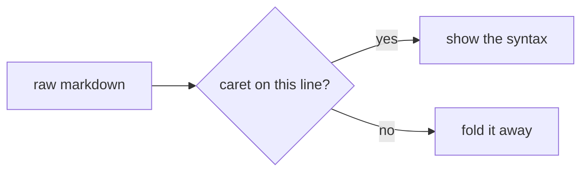
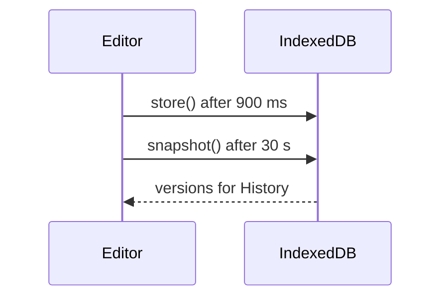

# Sumi feature demo

This file exercises everything Sumi renders. Open it, click into any block to see its source, and press ⌘⇧U to see the whole document as source. The block above is YAML front matter: it folds to a small card and is left out of exports.

[TOC]

## Headings

The line above is `[TOC]`, a table of contents built from the headings. With heading numbers on (Page ▸ Heading numbers) the entries are numbered, and because this document has a single `#` title the numbering starts at `##`.

### Third level

#### Fourth level

##### Fifth level

###### Sixth level

Setext heading
==============

Second setext heading
---------------------

## Paragraphs and inline styles

Text in **bold**, *italic*, ***both***, ~~struck through~~, ==highlighted== and `inline code`. Underscores work too: __bold__ and _italic_, but not inside_a_word.

A line ending in two spaces  
breaks here. A backslash at the end\
breaks as well.

Special characters can be escaped: \*not italic\*, \# not a heading, \[not a link\], 3 \* 4 = 12.

Links: [an inline link](https://commonmark.org "CommonMark"), [a reference link][spec], [a shortcut reference][], an autolink <https://daringfireball.net/projects/markdown/>, a bare URL https://github.github.com/gfm/ and www.example.com. Internal links jump to headings: [go to the table](#tables), [go to maths](#maths).

Footnotes[^one] are numbered in the order their definitions appear[^two]. Hover a reference to read it.

Inline maths sits in the sentence: $e^{i\pi} + 1 = 0$, and $\sqrt{a^2 + b^2}$. A plain number like $5 is not maths.

An image, here a small inline SVG so the demo works offline:


## Lists

- A bullet item
- Another, with **bold** and a [link](https://example.com)
  - Nested with two spaces
  - Press Tab and Shift-Tab to move items
    - Third level
- Back to the first level

1. Numbered
2. Press Enter to continue the list
3. Press Enter twice to leave it
   1. Nested numbers
   2. Renumber with ⌘⇧L

- [x] A done task
- [ ] An open task; click the circle in the margin to tick it
- [ ] ⌘⇧L cycles a line through bullet, numbered, task and plain

## Quotes and alerts

> A quote keeps its rule in the margin.
> It can run over several lines.

> [!NOTE]
> Notes, tips, important, warning and caution follow GitHub's syntax.
> The kind applies to every line of the block.

> [!TIP]
> The marker must be the first line of the quote, alone.

> [!IMPORTANT]
> Lower case works too: `[!important]`.

> [!WARNING]
> Unknown kinds such as `[!FOO]` stay ordinary quotes.

> [!CAUTION]
> Exports produce the same labelled blocks.

## Code

Fenced code with a language is highlighted, and Page ▸ Code line numbers adds line numbers:

```js
// render one line, folding the syntax away unless the caret is on it
function render(line, active) {
  const html = active ? line : fold(line);   /* comments
                                                span lines */
  return `<div class="line">${html}</div>`;
}
```

```python
def render(line, active):
    """Return the line, folded unless active."""
    return line if active else fold(line)
```

```css
.line.active .tok { font-size: inherit; opacity: .45; }
```

```
A fence without a language stays plain.
```

~~~
Tilde fences work as well.
~~~

    Indented code: four spaces, no highlighting.
    Second line.

## Tables

| Block       | Editing            | Alignment |
|:------------|:------------------:|----------:|
| Table       | folds to a grid    |     right |
| Mermaid     | folds to a chart   |    center |
| Maths block | folds to maths     |      left |

Cells take inline styles: **bold**, `code`, [links](https://example.com) and $x^2$. Click into the table to edit its source.

## Maths

Display maths sits on its own lines and gets a number with Page ▸ Equation numbers:

$$
\int_0^\infty x^{2} e^{-x}\,dx = 2
$$

$$
\begin{aligned}
\nabla \cdot \mathbf{E} &= \frac{\rho}{\varepsilon_0} \\
\nabla \cdot \mathbf{B} &= 0
\end{aligned}
$$

## Diagrams





## Raw HTML and rules

Raw HTML blocks are shown as source in the editor and passed through untouched in exports:

<details>
<summary>Click to expand in the exported page</summary>
Hidden text.
</details>

Three or more dashes, stars or underscores make a rule:

---

***

___

## Definitions

Reference and footnote definitions can live anywhere. They render faintly and are resolved wherever they are used.

[spec]: https://github.github.com/gfm/ "GitHub Flavored Markdown Spec"
[a shortcut reference]: https://spec.commonmark.org/

[^one]: The first footnote.
[^two]: The second, with *emphasis* and `code`.

## Beyond markdown

- **Themes**: Theme ▸ seven built-in themes, or drop a `.css` file on the window (see `themes/sample.css`).
- **Print**: ⌘P prints a compact page; Page ▸ Page break starts a new page at each `#` and `##`.
- **Documents and history**: File ▸ Documents lists everything written in this browser; File ▸ History keeps versions with diff and restore; File ▸ Backup exports all of it as one file.
- **Views**: View ▸ Focus, Typewriter, Outline, Source code; ⌘⇧R reveals all syntax while staying rendered.
